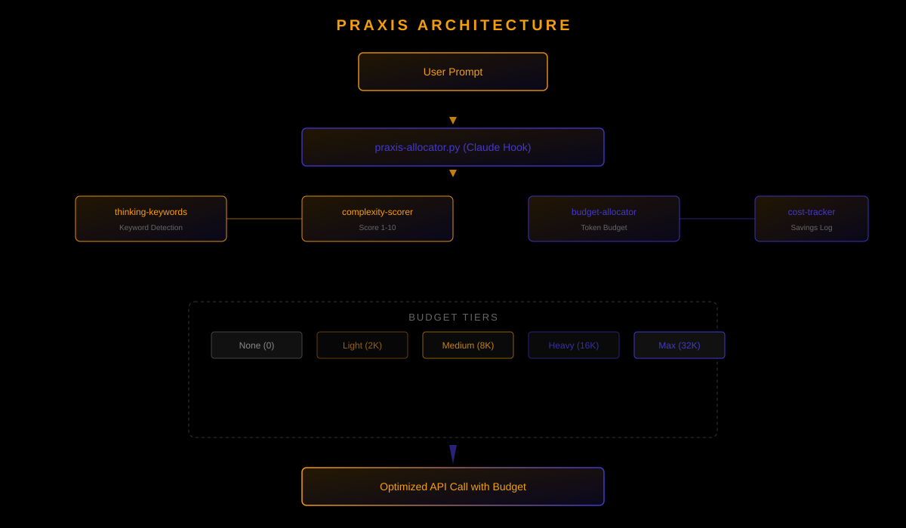

<p align="center">
  <strong>Allocate thinking tokens intelligently. Save cost. Preserve quality.</strong>
</p>

<p align="center">
  
  
  
  
</p>

---

## Why Praxis?

From Ancient Greek *πρᾶξις* (praxis), meaning the **practical application of theory**. In Aristotelian philosophy, praxis represented the bridge between abstract knowledge (*theoria*) and productive craft (*poiesis*) — the act of turning understanding into purposeful action.

PRAXIS embodies this philosophical tradition. Claude's extended thinking capability is powerful but expensive — raw *theoria* without discipline. Praxis transforms this into optimized action: analyzing each task's true complexity, allocating precisely the thinking budget needed, and eliminating wasteful over-computation. It is the bridge between unlimited thinking and practical efficiency.

## What is PRAXIS?

PRAXIS dynamically allocates Claude's thinking token budget based on task complexity. Instead of using maximum thinking tokens for every request (expensive), or none at all (lower quality for hard tasks), PRAXIS scores each prompt and assigns the optimal budget.

**The result:** Same quality on hard tasks, massive savings on simple ones.

```
Simple question  →  0 tokens      →  $0.00
Code modification →  2,048 tokens  →  $0.02
Architecture task →  16,384 tokens →  $0.18
Complex debugging →  32,768 tokens →  $0.37
```

## How It Works

<p align="center">
  
</p>

### Complexity Scoring

Prompts are scored 1-10 using multiple signals:

| Signal | Weight | Description |
|--------|--------|-------------|
| Keywords | 30% | Detected task-related keywords |
| Question Type | 30% | Factual, strategic, diagnostic, etc. |
| Length | 20% | Word count as complexity proxy |
| Structure | 20% | Code blocks, multiple questions |

### Budget Tiers

| Score | Tier | Tokens | Keyword |
|-------|------|--------|---------|
| 1-2 | None | 0 | — |
| 3-4 | Light | 2,048 | `think` |
| 5-6 | Medium | 8,192 | `think` |
| 7-8 | Heavy | 16,384 | `megathink` |
| 9-10 | Max | 32,768 | `ultrathink` |

## Installation

```bash
git clone https://github.com/pkmdev-sec/praxis.git
cd praxis
npm install
```

### As a Claude Code Hook

Add to your Claude Code settings (`~/.claude/settings.json`):

```json
{
  "hooks": {
    "UserPromptSubmit": [
      {
        "command": "python3 ~/praxis/hooks/praxis-allocator.py"
      }
    ]
  }
}
```

## Usage

### JavaScript API

```javascript
import { scoreComplexity } from './lib/complexity-scorer.mjs';
import { allocate, getOptimalBudget } from './lib/budget-allocator.mjs';
import { detectThinkingLevel, suggestLevel } from './lib/thinking-keywords.mjs';
import { trackThinkingCost, getThinkingSavings } from './lib/cost-tracker.mjs';

// Score a prompt
const score = scoreComplexity('Design a distributed cache system');
// → 7

// Allocate tokens
const budget = allocate(score);
// → { tokens: 16384, tier: 'heavy', model: 'claude-sonnet-4-6' }

// Or get optimal budget with cost limit
const optimal = getOptimalBudget('Fix the login bug', 0.05);
// → { tokens: 2048, tier: 'light', estimatedCost: 0.024, ... }

// Detect existing thinking keywords
const level = detectThinkingLevel('ultrathink about this problem');
// → { keyword: 'ultrathink', level: 'maximum', tokens: 32768 }

// Track costs and savings
trackThinkingCost(2048, 'claude-sonnet-4-6');
const savings = getThinkingSavings();
// → { totalSaved: 0.368, percentSaved: 93.75, ... }
```

### Python Hook (Standalone)

```bash
echo '{"prompt": "Design a microservice architecture"}' | python3 hooks/praxis-allocator.py
# → {"max_thinking_tokens": 16384, "complexity_score": 7, "decision": "auto_scored"}
```

## Modules

| Module | Description |
|--------|-------------|
| `lib/complexity-scorer.mjs` | Scores prompt complexity 1-10 |
| `lib/budget-allocator.mjs` | Maps scores to token budgets |
| `lib/thinking-keywords.mjs` | Manages think/megathink/ultrathink |
| `lib/cost-tracker.mjs` | Tracks spending and savings |
| `hooks/praxis-allocator.py` | Claude Code UserPromptSubmit hook |

## Testing

```bash
npm test
```

78 tests across 5 suites covering all modules and the Python hook.

## Project Structure

```
praxis/
├── lib/
│   ├── complexity-scorer.mjs    # Complexity scoring engine
│   ├── budget-allocator.mjs     # Token budget allocation
│   ├── thinking-keywords.mjs    # Thinking keyword management
│   └── cost-tracker.mjs         # Cost tracking and savings
├── hooks/
│   └── praxis-allocator.py      # Claude Code hook
├── tests/
│   ├── complexity-scorer.test.mjs
│   ├── budget-allocator.test.mjs
│   ├── thinking-keywords.test.mjs
│   ├── cost-tracker.test.mjs
│   └── praxis-allocator.test.mjs
├── assets/
│   └── banner.svg
├── docs/
│   ├── core-concepts/
│   │   ├── complexity-scoring.md
│   │   └── budget-allocation.md
│   └── visuals/
│       ├── architecture.md
│       └── architecture-diagram.svg
└── README.md
```

## License

MIT — see [LICENSE](LICENSE)
